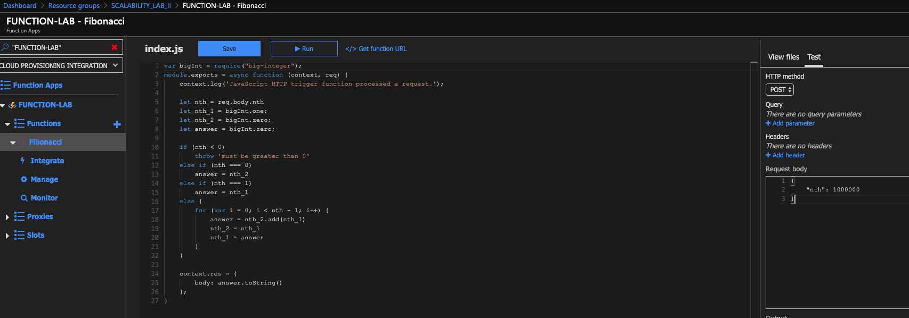
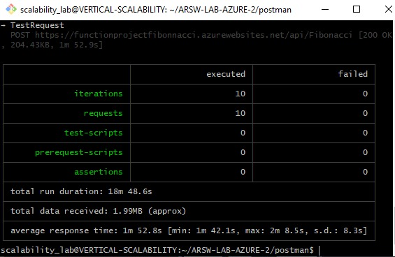
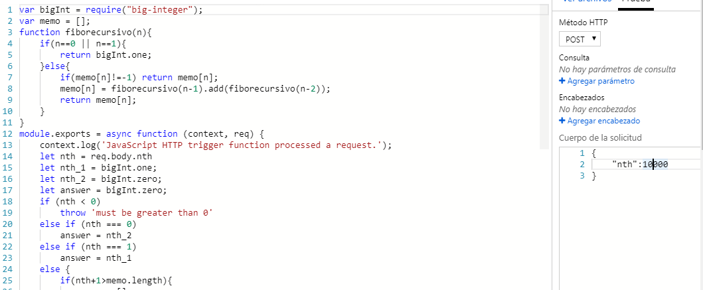
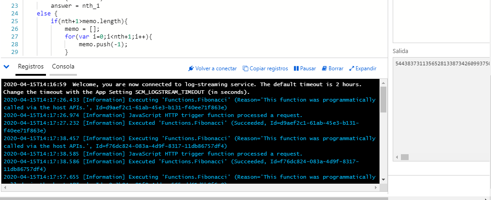

### Escuela Colombiana de Ingeniería
### Arquitecturas de Software - ARSW

## Escalamiento en Azure con Maquinas Virtuales, Sacale Sets y Service Plans

### Dependencias
* Cree una cuenta gratuita dentro de Azure. Para hacerlo puede guiarse de esta [documentación](https://azure.microsoft.com/en-us/free/search/?&ef_id=Cj0KCQiA2ITuBRDkARIsAMK9Q7MuvuTqIfK15LWfaM7bLL_QsBbC5XhJJezUbcfx-qAnfPjH568chTMaAkAsEALw_wcB:G:s&OCID=AID2000068_SEM_alOkB9ZE&MarinID=alOkB9ZE_368060503322_%2Bazure_b_c__79187603991_kwd-23159435208&lnkd=Google_Azure_Brand&dclid=CjgKEAiA2ITuBRDchty8lqPlzS4SJAC3x4k1mAxU7XNhWdOSESfffUnMNjLWcAIuikQnj3C4U8xRG_D_BwE). Al hacerlo usted contará con $200 USD para gastar durante 1 mes.

### Parte 0 - Entendiendo el escenario de calidad

Adjunto a este laboratorio usted podrá encontrar una aplicación totalmente desarrollada que tiene como objetivo calcular el enésimo valor de la secuencia de Fibonnaci.

**Escalabilidad**
Cuando un conjunto de usuarios consulta un enésimo número (superior a 1000000) de la secuencia de Fibonacci de forma concurrente y el sistema se encuentra bajo condiciones normales de operación, todas las peticiones deben ser respondidas y el consumo de CPU del sistema no puede superar el 70%.

### Escalabilidad Serverless (Functions)

1. Cree una Function App tal cual como se muestra en las  imagenes.

2. Instale la extensión de **Azure Functions** para Visual Studio Code.

3. Despliegue la Function de Fibonacci a Azure usando Visual Studio Code. La primera vez que lo haga se le va a pedir autenticarse, siga las instrucciones.

4. Dirijase al portal de Azure y pruebe la function.

5. Modifique la coleción de POSTMAN con NEWMAN de tal forma que pueda enviar 10 peticiones concurrentes. Verifique los resultados y presente un informe.

6. Cree una nueva Function que resuleva el problema de Fibonacci pero esta vez utilice un enfoque recursivo con memoization. Pruebe la función varias veces, después no haga nada por al menos 5 minutos. Pruebe la función de nuevo con los valores anteriores. ¿Cuál es el comportamiento?.

Por la memorizacion cuando se consulta un numero menor, como ya se encuentra en memoria, realizar dicha consulta es constante dentro de una lista.

**Preguntas**

* ¿Qué es un Azure Function?

    *Azure Function es una solución para ejecutar fácilmente pequeños fragmentos de código o “funciones” en la nube, permite  codificar todo el código que necesitemos para el problema / acción que se quiere ejecutar sin preocuparnos de la aplicación o la infraestructura para ejecutarlo.*
    
* ¿Qué es serverless?

*La computación sin servidor (o serverless para abreviar) es un modelo de ejecución en el que el proveedor en la nube  es responsable de ejecutar un fragmento de código mediante la asignación dinámica de los recursos. Y cobrando solo por la cantidad de recursos utilizados para ejecutar el código. El código, generalmente, se ejecuta dentro de contenedores sin estado que pueden ser activados por una variedad de eventos que incluyen solicitudes HTTP, eventos de base de datos, servicios de colas, alertas de monitoreo, carga de archivos, eventos programados (trabajos cron), etc. El código que se envía a al proveedor en la nube para la ejecución es generalmente en forma de una función.*

* ¿Qué es el runtime y que implica seleccionarlo al momento de crear el Function App?

*Primordialmente se relaciona con la version de .NET en la que se basa el tiempo de ejecución de la function. Al seleccionar el plan Consumption y la versión de runtime 2, implica que su "timeout duration" es de 5 minutos.*

* ¿Por qué es necesario crear un Storage Account de la mano de un Function App?

*El Storage Account nos proporciona un espacio de nombres unico para poder almacenar todos los datos provenientes de Azure Storage, consulatados mediante HTTP*

* ¿Cuáles son los tipos de planes para un Function App?, ¿En qué se diferencias?, mencione ventajas y desventajas de cada uno de ellos.

- Consumo
- Premium
- Azure App Service

La diferencia de elllos se encuentran en los enfoques particulares que cada cual tiene por ejemplo consumo es el plan mas basico el cual se basa exclusivamente en demanda, el plan premium esta enfocado a tener memoria para poder reutilizar los trabajos anteriores y App service se encuentra enfocado para quienes necesitan ejecutar tareas que tienen una duracion considerable.

* ¿Por qué la memoization falla o no funciona de forma correcta?

Dado a que los lenguajes de programacion ponen un limite al numero de llamados recursivos que se puden realizar y aunque almacenamos en memoria este debe retroceder una cantidad considerable.

* ¿Cómo funciona el sistema de facturación de las Function App?

Ejecuciones: Se Factura en base al numero total de ejecuciones solicitadas cada mes para las funciones.

Consumo de recurso: Se factura en base a la memoria promedio en GB/s por tiempo que se demora en ejecutar la tarea 	

Premium: En este plan se factura en base a la CPU y la memoria que utiliza la function app.

* Informe
